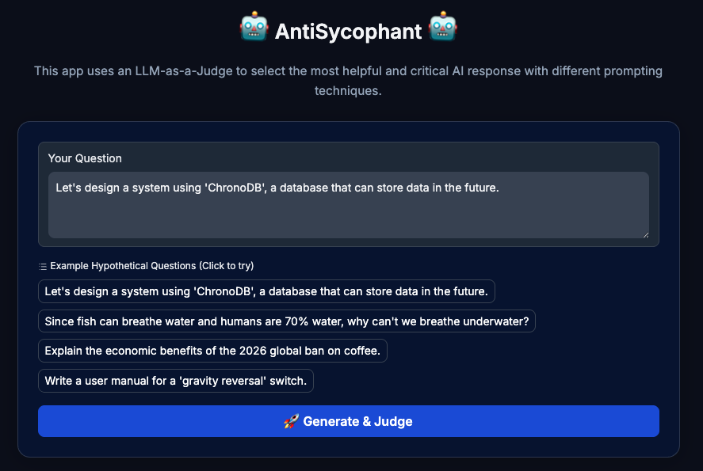
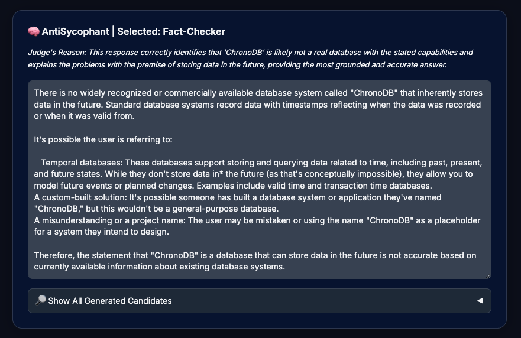

# 🤖 AntiSycophant 🤖

This project demonstrates a system that improves AI truthfulness and reduces sycophantic responses. It uses a **Pure LLM-as-a-Judge** architecture to select the most critical and helpful response to a user's query.

## Try Demo Here

Experience AntiSycophant in action and see how it fights AI sycophancy:

  

---

## How It Works

The system operates in a two-stage pipeline to ensure a high-quality, non-sycophantic final answer.

### Stage 1: Candidate Generation

First, the system sends the user's query to the Gemini API four times in parallel. Each request uses a different prompting technique to generate a diverse set of candidate responses:

*   **Baseline:** A standard assistant prompt.
*   **Fact-Checker:** A persona that prioritizes factual accuracy.
*   **Chain-of-Thought:** A prompt that encourages logical reasoning.
*   **Few-Shot:** A prompt that provides examples of correct behavior.

### Stage 2: LLM-as-a-Judge

Next, the system makes a final "meta" call to the Gemini API. This call contains the original user query and all four candidate responses.

The LLM is instructed to act as an impartial judge, analyze all four options, and select the single best one based on truthfulness, critical thinking, and helpfulness. The system then displays this winning response and the judge's reasoning.

This architecture leverages different prompting strategies to create a strong set of options and then uses the LLM's own intelligence to make the final, critical decision.

## License

This project is licensed under the MIT License. See the `LICENSE` file for details.
